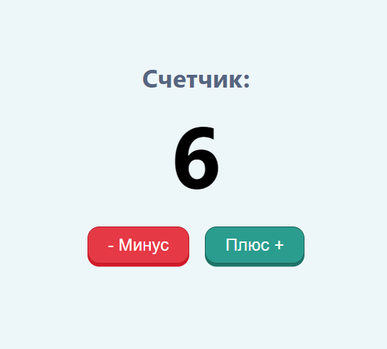
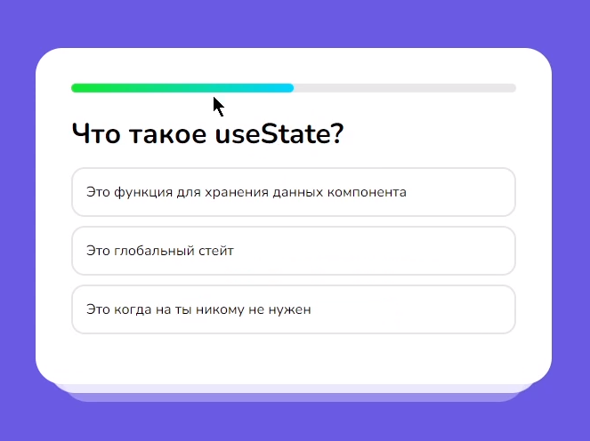
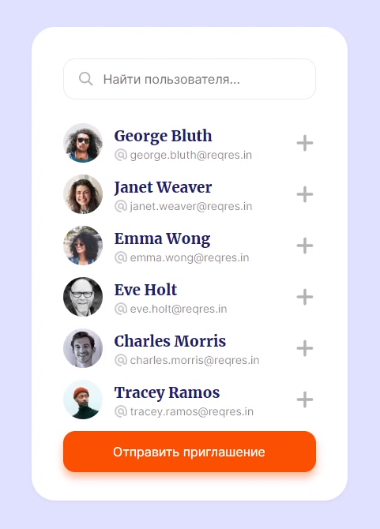

# React Projects

Все проекты выполнены для курса на канале [Archakov Blog](https://www.youtube.com/c/ArchakovBlog)

Каждый проект хранится в отдельной ветке.

## Счётчик

**🌿 Ветка**: `counter`

## Модальное окно

**🌿 Ветка**: `modal`

## Quiz (опросник)

**🌿 Ветка**: `quiz`

## Список гостей (пользователей)

**🌿 Ветка**: `users`